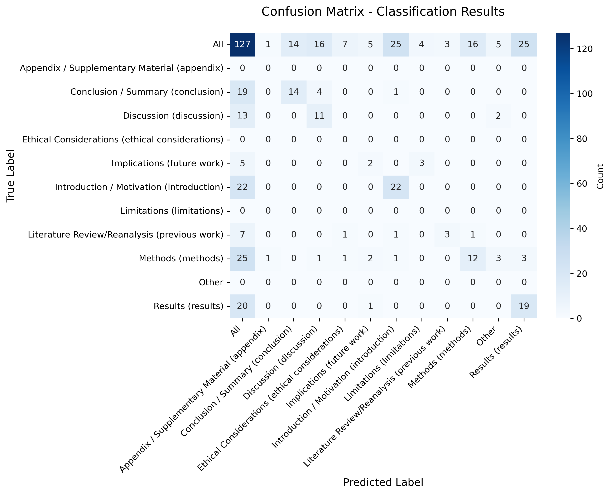
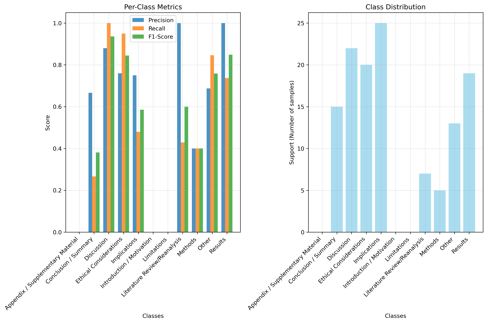

# Heurstics Evaluation (20250721_124626)
*Generated on 2025-07-21 12:46:40*

## Input Information

| Parameter | Value |
|-----------|-------|
| Data file | heuristics_results_20250721_115801.pkl |
| Classifications JSON | data/classifiers_LLM_generated.json |

### Parameters
| Parameter | Value |
|-----------|-------|
| pred_col | classification_highest_prob-heuristics |
| true_label_col | section_hand_label |
| section_title_col | section_title |
| probability_dist_col | probability_dist-heuristics |
| include_statistical_tests | True |

## Overall Performance

**Overall Accuracy:** 68.5% (87/127)

### Macro Average Metrics
| Metric | Value |
|--------|-------|
| Precision | 0.473 |
| Recall | 0.393 |
| F1-Score | 0.412 |

### Weighted Average Metrics
| Metric | Value |
|--------|-------|
| Precision | 0.789 |
| Recall | 0.685 |
| F1-Score | 0.709 |

## Per-Category Performance

| Category | Accuracy | Correct/Total |
|----------|----------|---------------|
| Introduction / Motivation | 100.0% | 22/22 |
| Methods | 48.0% | 12/25 |
| Results | 95.0% | 19/20 |
| Discussion | 84.6% | 11/13 |
| Conclusion / Summary | 73.7% | 14/19 |
| Literature Review/Reanalysis | 42.9% | 3/7 |
| Theoretical Framework | 26.7% | 4/15 |
| Implications | 40.0% | 2/5 |

## Top Misclassification Patterns

| True Label | Predicted Label | Count |
|------------|-----------------|-------|
| Conclusion / Summary | Discussion | 4 |
| Theoretical Framework | Ethical Considerations | 4 |
| Implications | Limitations | 3 |
| Methods | Results | 3 |
| Methods | Other | 3 |
| Theoretical Framework | Results | 3 |
| Theoretical Framework | Methods | 3 |
| Discussion | Other | 2 |
| Methods | Implications | 2 |
| Literature Review/Reanalysis | Ethical Considerations | 1 |

## Mapping Issues

- Unmapped true labels: {'other'}
- Unmapped categories: {'Other'}

## Statistical Tests

## Data Distributions

### True Label Distribution
```
section_hand_label
methods          25
introduction     22
results          20
conclusion       19
theory           15
discussion       13
previous work     7
future work       5
other             1
Name: count, dtype: int64
```

### Classification Distribution
```
classification_highest_prob-heuristics
Introduction / Motivation            25
Results                              25
Discussion                           16
Methods                              16
Conclusion / Summary                 14
Ethical Considerations                7
Theoretical Framework                 6
Other                                 5
Implications                          5
Limitations                           4
Literature Review/Reanalysis          3
Appendix / Supplementary Material     1
Name: count, dtype: int64
```

## Metrics Summary

### Understanding the Metrics

- **Precision**: Of the instances predicted as positive, what fraction was actually positive?
- **Recall**: Of the actual positive instances, what fraction was correctly predicted?
- **F1-Score**: Harmonic mean of precision and recall, providing a balanced measure.

### Macro vs Weighted Averages

- **Macro Average**: Simple average across all classes. Each class contributes equally regardless of size.
- **Weighted Average**: Average weighted by the number of true instances for each class. Larger classes have more influence.

### When to Use Each

- Use **Macro** when all classes are equally important, regardless of class imbalance.
- Use **Weighted** when you want to account for class imbalance and give more weight to larger classes.

## Plots Generated

**Confusion Matrix:** 

**Metrics Summary:** 
